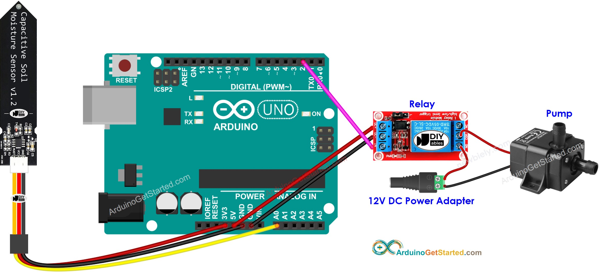
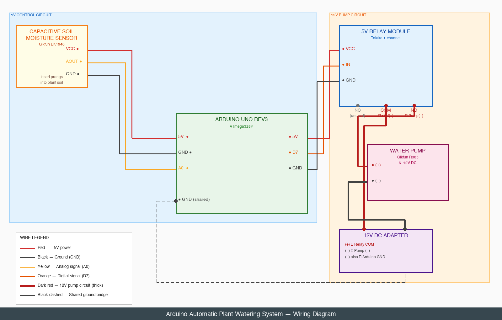

# WaterPlant — Master Plan

> **Status (2026-04-27):** Hardware Phase 1 done · Phase 2 next · Public dashboard live at <https://winnieyangwannan.github.io/WaterPlant/>

This is the **entry point** for the WaterPlant project. The repo is split across two parallel tracks plus a chronological session log. Read this doc first to figure out where to look for what.

---

## Project at a glance

WaterPlant is a standalone automatic plant watering system: an Arduino Uno reads soil moisture from a capacitive sensor, decides when soil has dried below a threshold, and triggers a 12V pump through a relay. A small daemon on a VPS ingests the Arduino's CSV-formatted serial output into SQLite, and a static dashboard surfaces each plant's profile, watering history, and care tips — both publicly via GitHub Pages and privately on the VPS for live readings. No SD card, no RTC — timestamps are added host-side. Designed to keep one (or several) houseplants alive while the user is away.

---

## How this repo is organized

The work splits into **two parallel tracks** plus a session log. Each owns its own plan doc; this file is just the index.

### Track A — Hardware (this doc, sections below)

Everything physical: Arduino firmware, sensor calibration, relay wiring, pump circuit, field test. Lives in `WaterPlant/`, `calibrate/`, with test writeups in `tests/` and diagrams in `docs/images/`.

The hardware track is owned by **this file** from "Hardware track" onwards.

### Track B — Software / dashboard ([`dashboard_plan.md`](dashboard_plan.md))

Per-plant profiles, the live dashboard, the serial-bridge → SQLite → HTML data pipeline, public deployment via GitHub Pages, and the LLM-agent collaborator (Xiaoxia) workflow. Lives in `server/`, `dashboard_preview/`, `plants/`, `prompts/`, and `.github/workflows/`.

If you want to know about anything *non-firmware* — how data flows, how the dashboard is built, how Xiaoxia operates the system, what gets deployed where — read [`dashboard_plan.md`](dashboard_plan.md).

### Session log ([`docs/sessions/`](sessions/))

Chronological "what we did, why, when" notes. Each session adds one date-prefixed file. Read these to catch up on recent work without scrolling through git history. New collaborators (human or LLM) should skim the most recent entry first.

---

## Status snapshot

| Track | Phase | Status | Doc / artifact |
|---|---|---|---|
| Hardware | **1** — Calibrate sensor | ✅ Done 2026-04-26 (`SENSOR_DRY=458`, `SENSOR_WET=265`) | [tests/phase1_calibration.md](../tests/phase1_calibration.md) |
| Hardware | **2** — Basic wiring + no-pump test | ⏳ Next | (writeup pending) |
| Hardware | **3** — Pump + relay integration | ⬜ Pending | — |
| Hardware | **4** — Field test | ⬜ Pending | — |
| Software | **D1** — Logger + schema | 🟡 Code on disk (`server/logger.py`, `server/schema.sql`); will start ingesting once hardware Phase 2 is wired | [dashboard_plan.md](dashboard_plan.md#d1--logger--schema-depends-on-hardware-phase-2) |
| Software | **D2** — Plant profile via Xiaoxia | 🟡 Goldie's YAML + photo committed; `prompts/care_tips.md` not yet pinned | [plants/1.yaml](../plants/1.yaml) |
| Software | **D3a** — Public preview site | ✅ Live | <https://winnieyangwannan.github.io/WaterPlant/> |
| Software | **D3b** — Live VPS dashboard (basic auth) | ⬜ Gated on hardware Phase 2 | [dashboard_plan.md](dashboard_plan.md#d3b--live-vps-dashboard-with-basic-auth) |
| Software | **D4** — Watering before/after pairing | ⬜ Gated on Phase 3 | [dashboard_plan.md](dashboard_plan.md#d4--watering-history--beforeafter-pairing) |
| Software | **D5** — Polish (sensor health, predictions, pump-effectiveness flag) | ⬜ Pending | [dashboard_plan.md](dashboard_plan.md#d5--polish-sensor-health-predicted-next-watering-pump-effectiveness-flag) |
| Software | **D6** — Surface convergence (preview ↔ live) | 🔵 Deferred until real data flows | [dashboard_plan.md](dashboard_plan.md#public-deployment-surface-github-pages) |
| Software | **D7** — Visual polish (emoji garden index, v1) | ⏳ Active 2026-04-27 — emoji-as-placeholder, building now | [dashboard_plan.md](dashboard_plan.md#d7--visual-polish-pixel-garden-index--new-2026-04-27) |
| Software | **D7b** — Garden event-driven motion (Xiaoxia walks, watering animation) | 🔵 Deferred until D7 v1 ships + real readings flow | [dashboard_plan.md](dashboard_plan.md#d7b--event-driven-motion-deferred-until-real-readings-flow) |
| Software | **D7c** — Replace emoji with custom pixel sprites (Gemini-generated) | 🔵 Deferred — needs Google Cloud billing | [dashboard_plan.md](dashboard_plan.md#sprite-generation--gemini-25-flash-image-nanobanana--deferred-to-d7c) |

Legend: ✅ done · ⏳ active · 🟡 partial · ⬜ pending · 🔵 deferred

---

## Where to find things

| If you want to know about… | Read |
|---|---|
| The big picture and current status | This file (you're here) |
| How the dashboard, data pipeline, and Xiaoxia integration work | [`dashboard_plan.md`](dashboard_plan.md) |
| What changed recently and why | [`docs/sessions/`](sessions/) — newest file first |
| Phase 1 sensor calibration writeup | [`tests/phase1_calibration.md`](../tests/phase1_calibration.md) |
| The serial bridge (Arduino → Mac → VPS) | [`docs/arduino-serial-bridge.md`](arduino-serial-bridge.md) |
| Wiring diagrams | [`docs/images/`](images/) |
| Quick repo orientation for newcomers | [`README.md`](../README.md) |
| Per-plant profile data | [`plants/<id>.yaml`](../plants/) |
| Rules of the road for Xiaoxia (LLM agent) | [`dashboard_plan.md` § Rules of the road](dashboard_plan.md#rules-of-the-road-for-xiaoxia) |

---

## Collaborators

- **Winnie** ([@winnieyangwannan](https://github.com/winnieyangwannan)) — owner, plant parent, hardware operator
- **Xiaoxia** ([@xiaoxiaopenclaw](https://github.com/xiaoxiaopenclaw)) — LLM agent collaborator, lives in a VM with serial-stream + repo edit access. Operates on YAML files in `plants/` and runs `server/render.py`. Read the rules-of-the-road section in [`dashboard_plan.md`](dashboard_plan.md#rules-of-the-road-for-xiaoxia) before making code changes.
- **Claude** (via Cowork) — planning + edits in working sessions, commits authored by Winnie. Saves session summaries to [`docs/sessions/`](sessions/) autonomously.

---
---

# Hardware track

Everything below this line is the hardware track: the Arduino firmware, the wiring, and the four physical-build phases. For the software/dashboard track see [`dashboard_plan.md`](dashboard_plan.md).

## Context

Build a standalone automatic plant watering system using Arduino Uno. It monitors soil moisture in real-time and waters the plant only when needed. Logging is via Serial Monitor (CSV-formatted output) — no SD card or RTC module required. Timestamping happens host-side in the logger daemon (see Track B); the Arduino emits only its uptime in `millis()`.

---

## Hardware you have

| Item | Model | Role |
|------|-------|------|
| [Arduino Uno REV3](https://www.amazon.com/dp/B008GRTSV6) | ATmega328P | Main controller |
| [Capacitive Soil Moisture Sensor](https://www.amazon.com/dp/B07H3P1NRM) | Gikfun EK1940 ×2 | Analog moisture reading (corrosion-resistant) |
| [5V Relay Module](https://www.amazon.com/dp/B00VRUAHLE) | Tolako 1-channel | Switches pump power circuit |
| [Mini Water Pump](https://www.amazon.com/dp/B07DW4WRV8) | Gikfun R385 | 6–12V DC, includes 1m tube |
| 12V DC Adapter | (you have one) | Powers the pump through relay |
| [Breadboards Kit](https://www.amazon.com/dp/B07DL13RZH) | 830pt + 400pt ×2 | Prototyping |
| [Jumper Wires](https://www.amazon.com/dp/B07GD3KDG9) | EDGELEC 120pcs 50cm | M-F, M-M, F-F |

## Additional items still needed

| Item | Why | Note |
|------|-----|------|
| Water reservoir | Holds the water supply | Any bucket, bottle, or container |
| Extra silicone tubing | Route water from pump to plant | Pump includes 1m; extend if needed |
| USB cable (Type-B) | Program Arduino + Serial Monitor | Likely already have one |

---

## Wiring diagram

### Reference wiring (ArduinoGetStarted.com)

*Source: [arduinogetstarted.com](https://arduinogetstarted.com/tutorials/arduino-soil-moisture-sensor-pump)*

### Full diagram (all your exact components)


> Reference diagrams from similar builds:
> - [Arduino + Soil Moisture + Relay + Pump (arduinogetstarted.com)](https://arduinogetstarted.com/tutorials/arduino-soil-moisture-sensor-pump)
> - [Capacitive Sensor Circuit Diagram (electroniclinic.com)](https://www.electroniclinic.com/capacitive-soil-moisture-sensor-arduino-circuit-diagram-and-programming/)

### Pin summary table

| Wire | From | To | Color suggestion |
|------|------|----|-----------------|
| Power | Arduino 5V | Sensor VCC | Red |
| Ground | Arduino GND | Sensor GND | Black |
| Signal | Sensor AOUT | Arduino A0 | Yellow |
| Power | Arduino 5V | Relay VCC | Red |
| Ground | Arduino GND | Relay GND | Black |
| Control | Arduino D7 | Relay IN | Orange |
| Pump power | 12V adapter (+) | Relay COM | Red (thick) |
| Pump positive | Relay NO | Pump (+) | Red (thick) |
| Pump negative | Pump (−) | 12V adapter (−) | Black (thick) |
| Shared ground | 12V adapter (−) | Arduino GND | Black |

### Relay terminal positions (Tolako module, left to right)

```
  ┌─────────────────────────────────────┐
  │  TOLAKO RELAY MODULE — TOP VIEW     │
  │                                     │
  │  Control side:    Load side:        │
  │  [VCC][GND][IN]   [NC][COM][NO]     │
  │    │    │    │      │    │    │     │
  │    │    │    │      X  USE  USE     │
  │    │    │    │    (not  ↑    ↑      │
  │    │    │    │    used) │    │      │
  └────┼────┼────┼──────────┼────┼─────┘
       │    │    │          │    │
      5V   GND  D7        12V(+) Pump(+)
  (Arduino)(Arduino)(Arduino)
```

> **NC = Normally Closed** (connected when relay is OFF — do NOT use this terminal)
> **NO = Normally Open** (connected when relay is ON / pump runs — use this one)
> **COM = Common** (always connected, this is your 12V input)

> **Safety rule**: The 12V and 5V circuits share only the GND rail. Never connect 12V to any Arduino pin.

---

## Code architecture

```
WaterPlant/
├── WaterPlant.ino    # Main sketch: setup + loop
├── config.h          # All tunable constants (pins, thresholds, timing, calibration)
├── moisture.h        # Sensor read, averaging, map to %
└── pump.h            # Relay control with safety limits
```

### config.h
```cpp
// Pins
#define MOISTURE_PIN      A0
#define RELAY_PIN         7

// Sensor calibration (run calibrate/calibrate.ino first to find your sensor's range)
// Calibrated 2026-04-26: dry air ≈ 458, fully submerged ≈ 265.
#define SENSOR_DRY        458   // raw ADC in dry air (higher = drier)
#define SENSOR_WET        265   // raw ADC fully submerged (lower = wetter)

// Moisture thresholds
#define MOISTURE_LOW      30    // % — start watering below this
#define MOISTURE_HIGH     60    // % — stop watering above this

// Timing
#define READ_INTERVAL_MS  60000UL   // read & log every 60 seconds
#define PUMP_MAX_MS       3000UL    // max pump runtime per trigger
#define PUMP_COOLDOWN_MS  300000UL  // 5-min cooldown between waterings
```

### Main loop logic (WaterPlant.ino)
```
setup():
  Serial.begin(9600)
  print CSV header: "millis,moisture_pct,event"
  relay pin → OUTPUT, LOW (pump OFF)

loop():
  every READ_INTERVAL_MS:
    pct = readMoisture()           // average 10 ADC samples → map to %
    Serial.println(millis + "," + pct + "," + event)

    if pct < MOISTURE_LOW AND cooldownElapsed:
      pump ON  → Serial.println(... "PUMP_ON")
      wait PUMP_MAX_MS
      pump OFF → Serial.println(... "PUMP_OFF")
      record cooldown start
```

### moisture.h — reading logic
- Take 10 ADC samples, discard min/max, average the rest (noise reduction)
- `map(avg, SENSOR_DRY, SENSOR_WET, 0, 100)` → moisture percentage
- Clamp to 0–100%

### pump.h — safety logic
- `pumpOn()`: digitalWrite(RELAY_PIN, HIGH) + record start time
- `pumpOff()`: digitalWrite(RELAY_PIN, LOW)
- Hard safety: if pump has been ON > PUMP_MAX_MS, force off
- Cooldown enforced by timestamp comparison in main loop

### Serial Monitor output (CSV)
```
millis,moisture_pct,event
0,--,INIT
60000,24,
60000,24,PUMP_ON
63000,24,PUMP_OFF
120000,38,
180000,55,
```
Copy-paste into Excel/Sheets for charting, or let `server/logger.py` ingest it into SQLite (see [`dashboard_plan.md`](dashboard_plan.md)).

> **Multi-plant note:** Once a second sensor is added, the CSV gains a `sensor_idx` column → `millis,sensor_idx,moisture_pct,event`. The host-side mapping `sensor_idx → plant_id` lives in [`plants/_sensor_map.yaml`](../plants/_sensor_map.yaml). Full details in [`dashboard_plan.md` § Required Arduino changes](dashboard_plan.md#required-arduino-changes).

---

## Implementation phases (hardware)

> These are hardware phases only. For software/dashboard phases (**D1–D6**), see [`dashboard_plan.md` § Implementation phases](dashboard_plan.md#implementation-phases-software-track). The two tracks run in parallel — no need to finish hardware Phase 4 before starting on software.

### Phase 1 — Calibrate sensor ✅ Done 2026-04-26
1. Upload `calibrate/calibrate.ino` (prints raw ADC value every second)
2. Hold sensor in dry air → note value → set `SENSOR_DRY` in config.h
3. Dip sensor in water → note value → set `SENSOR_WET` in config.h

Result: `SENSOR_DRY=458`, `SENSOR_WET=265`. Full writeup in [`tests/phase1_calibration.md`](../tests/phase1_calibration.md).

### Phase 2 — Basic wiring + no-pump test ⏳ Next
1. Wire moisture sensor to A0
2. Wire relay control side (5V→VCC, GND→GND, D7→IN). Leave 12V pump load disconnected.
3. Upload main sketch
4. Verify Serial Monitor shows correct moisture % as you move sensor wet/dry, and the relay clicks audibly when threshold trips (temporarily set `MOISTURE_LOW=90` to force a click)

### Phase 3 — Add pump + relay
1. Wire relay to D7 and connect pump circuit with 12V adapter
2. Set `MOISTURE_LOW = 90` temporarily → pump should trigger immediately
3. Verify pump activates and stops after `PUMP_MAX_MS`
4. Reset thresholds to real values

### Phase 4 — Field test
1. Insert sensor in plant soil
2. Let run for several hours
3. Copy Serial Monitor log to spreadsheet and plot moisture over time (or watch the live VPS dashboard once D3b is up)

---

## Libraries required
All built-in to Arduino IDE — no installs needed.

---

## Learning resources & tutorials

| Topic | Resource |
|-------|----------|
| Breadboard basics | [How to Use a Breadboard — YouTube](http://youtube.com/watch?v=zvCdkV52cis) |

---

## Reference projects
- [Automatic Watering System — Arduino Project Hub](https://projecthub.arduino.cc/lc_lab/automatic-watering-system-for-my-plants-e4c4b9)
- [Soil Moisture Sensor with LCD, RTC, SD Logger — Instructables](https://www.instructables.com/Soil-Moisture-Sensor-LCD-RTC-SD-Logger-Temperature/)
- [SriTu Hobby — Step-by-step irrigation guide](https://srituhobby.com/how-to-make-an-automatic-irrigation-and-plant-watering-system-using-arduino-and-soil-moisture-sensor-step-by-step-instruction/)
