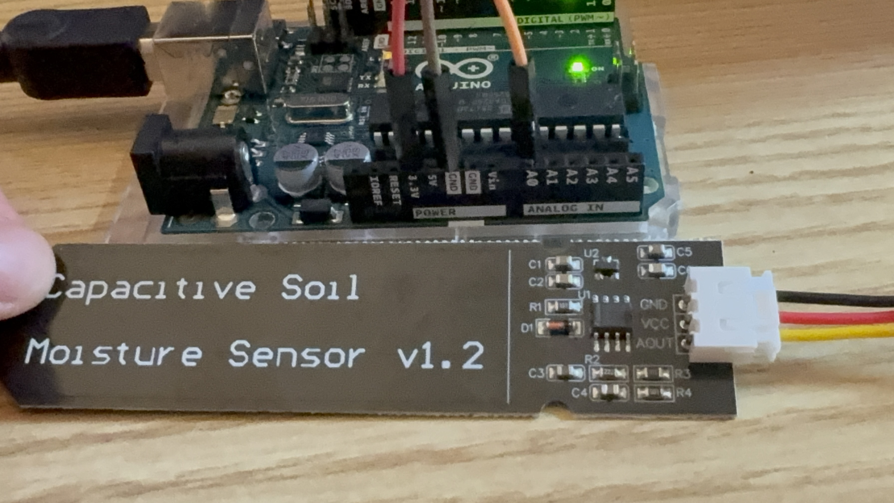

# Phase 1 — Sensor Calibration

## Goal

Find the **raw ADC values** that the capacitive soil moisture sensor produces at its two extremes (fully dry air and fully submerged in water), then store them in `WaterPlant/config.h` as `SENSOR_DRY` and `SENSOR_WET`. The main sketch uses these two endpoints to map raw ADC → moisture percentage via `map()`. Without calibration the percentage is meaningless because every sensor unit and wiring setup has slightly different baselines.

## Hardware Used

| Item | Notes |
|------|-------|
| Arduino Uno REV3 | Connected via USB-B to Mac, appeared as `/dev/cu.usbmodem11301` |
| Capacitive Soil Moisture Sensor (Gikfun EK1940) | VCC→5V, GND→GND, AOUT→A0 |
| Glass of room-temperature tap water | For the wet endpoint |
| Paper towel | For drying the probe between tests |

## Wiring (sensor only, for Phase 1)

```
Arduino 5V  ──────► Sensor VCC
Arduino GND ──────► Sensor GND
Arduino A0  ──────► Sensor AOUT
```

The relay and pump are not connected during Phase 1. The sensor alone is sufficient.


*Actual setup used during this calibration: Capacitive Soil Moisture Sensor v1.2 wired to the Uno via the JST connector — black to GND, red to 5V, yellow to A0.*

## Software Setup

- **Arduino IDE** 2.3.8 on macOS
- Board: **Arduino Uno**
- Port: **`/dev/cu.usbmodem11301`** (yours will differ — pick the `cu.usbmodem*` entry that appears when the Uno is plugged in)
- Sketch: `calibrate/calibrate.ino` (already in this repo)

## Procedure

### 1. Open the calibration sketch

In Arduino IDE: **File → Open** (`Cmd+O`), then navigate to:

```
/Users/<you>/Documents/Projects/WaterPlant/calibrate/calibrate.ino
```

Tip: In the macOS file dialog, press `Cmd+Shift+G` to paste an absolute path directly.

### 2. Verify board and port

Check the toolbar dropdown shows **Arduino UNO** and the status bar at the bottom shows the right serial port (e.g. `/dev/cu.usbmodem11301`). If wrong, fix via **Tools → Board** and **Tools → Port**.

### 3. Upload the sketch

Press **`Cmd+U`** (or click the right-arrow Upload button).

> **Heads-up about Arduino IDE 2.x output panel:** by default it only prints the compile summary (e.g., `Sketch uses 2164 bytes (6%) of program storage space`). It does **not** print "Done uploading" — that's normal. If compile succeeds and the LEDs on the Uno flicker briefly, the upload is done. To see verbose upload output, enable it in **Preferences → Show verbose output during: upload**.

### 4. Open Serial Monitor

Press **`Cmd+Shift+M`** to open Serial Monitor.

Set the baud-rate dropdown (top-right of the Serial Monitor pane) to **`9600 baud`** — this must match `Serial.begin(9600)` in the sketch. With the wrong baud you'll see garbage characters.

You should now see:

```
Calibration mode — open Serial Monitor at 9600 baud
Raw ADC value printed every second.
Dry air value → SENSOR_DRY | In water value → SENSOR_WET
Raw: 458
Raw: 458
Raw: 458
...
```

### 5. Capture the dry-air value

1. Wipe any soil/moisture off the white probe area with a dry paper towel.
2. Hold the probe in **open air** — don't touch the metal/PCB region with your fingers (your skin's capacitance shifts the reading).
3. Wait ~10 seconds for the value to stabilize.
4. Record the steady value as `SENSOR_DRY`.

If the probe was previously wet, the number will slowly **rise** as it dries. Wait until it's flat (±2).

### 6. Capture the submerged value

1. Dip **only the bottom probe** into water — submerge up to (but not past) the white line marked on the sensor body.
2. **Do NOT submerge the green PCB top with the chip and pin headers.** Soaking the electronics will destroy the sensor.
3. Wait ~10 seconds. The value should drop sharply.
4. Record the steady low value as `SENSOR_WET`.

### 7. Write the values into `config.h`

Edit `WaterPlant/config.h`:

```cpp
#define SENSOR_DRY        458   // raw ADC in dry air (higher = drier)
#define SENSOR_WET        265   // raw ADC fully submerged (lower = wetter)
```

## Test Results (this run)

| Condition | Observed Raw ADC | Notes |
|----------|------------------|-------|
| Probe dirty, sitting in soil | ~426 | Initial reading before cleanup — soil residue affecting dielectric |
| Probe just cleaned, wet | ~398–414 | Drying-out transient, not yet stable |
| Probe clean and fully dry, in air | **458** | Stable for >30 s — recorded as `SENSOR_DRY` |
| Probe submerged in water | **265** | Stable for >10 s — recorded as `SENSOR_WET` |

**Effective calibration range:** `458 − 265 = 193` ADC counts between fully dry and fully wet. (For reference, the placeholder defaults of 620/310 in the original `config.h` were just guesses — every sensor differs.)

## Useful Commands & Shortcuts

| Action | Shortcut / Command |
|--------|------------------|
| Open file in Arduino IDE | `Cmd+O` |
| Paste absolute path in macOS file dialog | `Cmd+Shift+G` |
| Verify (compile only) | `Cmd+R` |
| Upload to board | `Cmd+U` |
| Open Serial Monitor | `Cmd+Shift+M` |
| Open Serial Plotter (live graph) | `Cmd+Shift+L` |
| List connected serial ports (Mac shell) | `ls /dev/cu.usbmodem*` |

## Gotchas / Lessons Learned

1. **Clean the probe before calibrating.** Leftover soil holds moisture and lowers the "dry" reading. Our first attempt read 426 because of dirt — after cleaning and drying it climbed to its true dry value of 458.
2. **Don't touch the probe with bare fingers during dry calibration.** Your skin acts as extra dielectric and shifts the reading.
3. **Baud rate must match.** Sketch uses `Serial.begin(9600)`; Serial Monitor must be set to `9600 baud`. A mismatch shows gibberish (or sometimes deceptively clean output if the Uno's USB-CDC layer is forgiving).
4. **Arduino IDE 2.x doesn't show "Done uploading"** in the default output panel. Don't take silence as failure — if compile succeeded and the on-board LEDs flickered, the flash worked.
5. **The dry value is higher than the wet value.** This is correct for a *capacitive* sensor — more water around the probe = higher capacitance = lower ADC reading. Resistive sensors are inverted.
6. **The exact numbers don't matter — the spread does.** Anything from ~400 to ~600 dry and ~200 to ~350 wet is plausible depending on your sensor unit, supply voltage, and wiring.

## How to Verify Calibration Is Sane

After updating `config.h`, the main sketch will compute moisture % as:

```
pct = map(raw, SENSOR_DRY, SENSOR_WET, 0, 100)
```

So:
- Probe in dry air → raw ≈ 458 → ~0% ✓
- Probe in water → raw ≈ 265 → ~100% ✓
- Probe in damp soil → raw somewhere between → 30–80% (depending on how damp)

If you ever see negative or >100% values clamping, recalibrate — your real-world soil readings have drifted outside the dry/wet endpoints you captured.

## What's Next — Phase 2

With calibration done, the next step is **Phase 2: basic wiring + no-pump test**:
- Wire the relay control side (5V → VCC, GND → GND, D7 → IN). Leave the 12V pump load circuit disconnected.
- Upload `WaterPlant/WaterPlant.ino` (the main sketch).
- Verify the Serial Monitor at 9600 baud shows correct moisture percentages as you move the sensor between wet and dry, and the relay clicks when the threshold trips.
